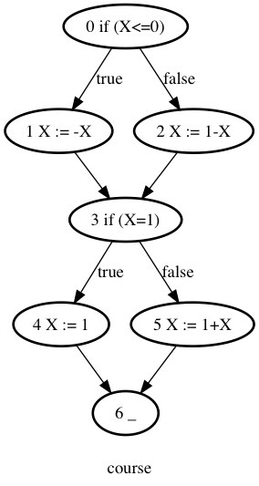
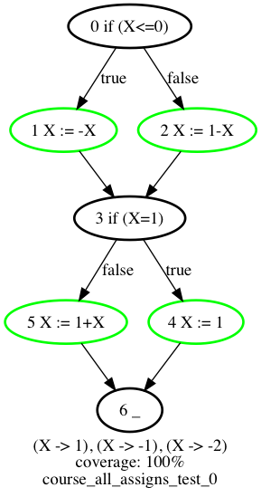
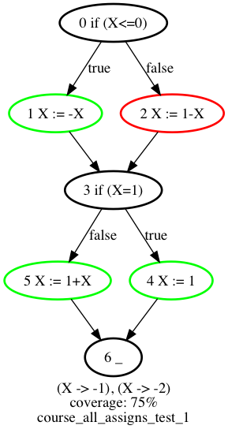
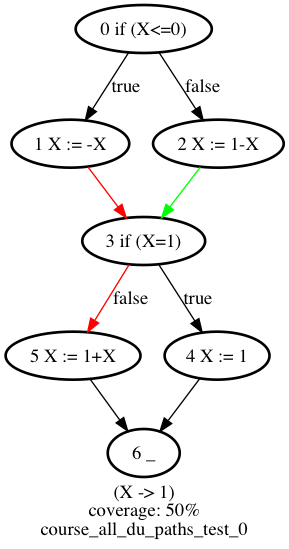
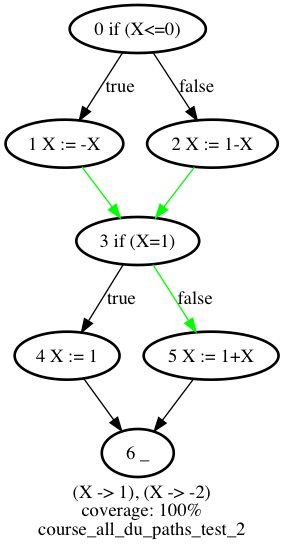
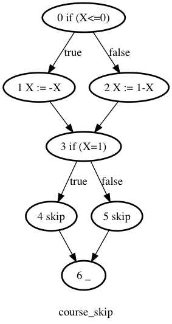
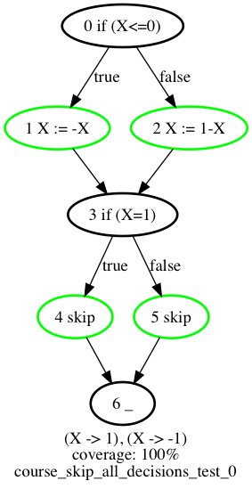
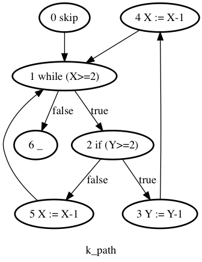

Execution Symbolique et Test Structurel
======

Projet d'Introduction à la Vérification Formelle

Ghislain Jeanneau & Arnault Chazareix

Le but de ce projet est de construire un outil d'analyse de couverture et de génération de test sur le langage **WHILE annoté**.

#### Table des matières

1. [Architecture du projet](#1-architecture-du-projet)
2. [Choix de conception](#2-choix-de-conception)
3. [Utilisation](#3-utilisation)
4. [Applications et exemples](#4-applications-et-exemples)


## 1. Architecture du projet

Ce projet est orienté autour de plusieurs concepts
 * L' Abstract Syntax Tree (classe `AST` et filles) et le Control Flow Graph (classe `CFG`)
 * Les critères (classes `Criterion` et filles) qui génèrent une couverture attendue et un générateur de test
 * La vérification de couverture (classes `Coverage` et `CoverageUnit`)
 * La génération de tests (classes `TestGenerator` et filles)

Une documentation complète du code se trouve dans `/docs` et est accessible [ici](https://ghigi123.github.io/ivf/IVF/index.html)

### Définition de l'Abstract Syntax Tree (AST)

L'AST est défini sous forme de `case class` en scala. Plus d'informations sur scala dans la partie [choix du langage](#choix-du-langage).

Organisation des classes filles d'AST : 
* `AST` classe abstraite de base
	* `Command` représente une commande parmi : 
		* `If`, une condition, deux ASTs enfants,
		* `While`, une condition, un AST enfant,
		* `Sequence` (liste de commandes), 
		* `Skip`,
		* `Assign` 
	* `B` espace de nom qui définit les Expressions Booléennes : 
		* `Operator` énumération :
			* `Binary` : `Or`, `And`
			* `Unary` : `Not`
		* `Expression` représente une expression booléenne :
			* `Value`  : `true` ou `false`
			* `Binary` : prend un opérateur `B.Binary` et 2 `B.Expression`s
			* `Unary` : prend un opérateur `B.Unary` et 1 `B.Expression`
			* `Comparator` : prend un `A.Comparator` et 2 `A.Expression`
	* `A` espace de nom qui définit les Expressions Arithmétiques : 
		*   `Operator` énumération :
			* `Binary` : `Plus`, `Sub`, `Mul`, `Div`
			* `Unary` : `Plus`, `Sub`
		* `Comparator` énumération :
			* `GreaterEqual` : supérieur ou égal
			* `Greater` : supérieur strictement
			* `Equal` : égal
			* `Less` : inférieur strictement
			* `LessEqual` : inférieur ou égal
		* `Expression` : représente une valeur entière
			* `Value` : prend un entier en paramètre
			* `Variable` : variable représentée par son nom
			* `Binary`, `Unary` : prend des `A.Operator` et `A.Expression`

### Définition du Control Flow Graph (CFG)
Le Control Flow Graph (CFG) est défini grâce à la librairie [scala-graph](http://www.scala-graph.org/). Les noeuds sont des entiers qui sont les labels associés aux ASTs. Le CFG stocke également une table de label vers l'objet AST associé.

On a fait le choix de représenter les commandes sur les noeuds plutôt que sur les arrêtes, par manque d'attention au début, et il s'est avéré que ce choix n'a posé aucun problème par la suite.

Les labels ne sont pas présent dans la source : ils sont générés automatiquement par conversion de l'AST en CFG (fonction `toCFG` dans `AST.Command`)

Notons les deux fonctions `backwardPathBuilderAux` et `forwardPathBuilderAux` qui jouent un rôle essentiel dans le parcours des CFG et la construction des chemins utilisés autant pour la vérification de couverture que pour la génération des tests. Nous recommandons la lecture de la documentation de ces fonctions.

### Définition de la couverture

La notion de couverture est représentée par la classe `Coverage` et ses classes filles :
 * `NodeCoverage` : des noeuds doivent être atteints
 * `PathCoverage` : des chemins doivent être atteints
 * `SourceTargetCoverage` : un chemin allant de `source` à `target` doit être couvert pour chaque couple `(source, target)`
 * `SourceToAnyTargetCoverage` : un chemin partant de `source ` et allant à n'importe quel `target` dans `targets` doit être couvert pour chaque couple `(source, [target1, target1 ...])`

Ces classes prennent en paramètre les unités de couverture suivantes :
 * `Node`
 * `Path`
 * `SourceTarget`
 * `SourceTargets`

### Génération de tests

Les classes `TestGeneratorMap` et `PathTestGenerator` permettent de générer tous les tests. On se base en effet sur les chemins pour générer les tests : pour un chemin donné, on peut aisément renommer les variables de façon à ce qu'elles ne soient définies qu'une fois (Single Static Assignment), les transformer en contraintes, et obtenir la valuation associée.

On utilise la librairie [choco-solver](http://www.choco-solver.org/) pour résoudre les systèmes de contraintes.

L'illustration suivante permet de se rendre compte de l'intérêt de cette définition (pour le critère tous les DU chemins ici) :


* `PathTestGenerator` permet de générer une valuation pour un test (`State` dans le code) à partir d'un chemin
* `TestGeneratorMap` permet de combiner les `PathTestGenerator` en utilisant une structure d'arbre, avec un paramètre `Any` ou `All` qui décrit si tous les enfants doivent être présent ou seulement un dans le critère.

### Définition des critères

Les critères sont définis dans le fichier `Criterion.scala`. Ils dérivent tous d'une classe abstraite `Criterion` qui requiert l'implémentation d'une fonction `build` retournant :
 * Un générateur de test
 * Une couverture requise

## 2. Choix de conception

### Structures de données

Les structures de données décrites ci-dessus ont fait l'objet de divers choix de conception :

 * Le CFG est défini comme des AST sur des noeuds pour les raisons déjà évoquées.
 * La génération de test a été réalisée avant la vérification des critères. Il semble que nous aurions pu étendre la définition existante des TestGenerator pour y inclure les tests de couverture. Nous avons cependant choisi de réécrire un certain nombre de mécanismes dans les classes `Coverage` et filles, de façon à simplifier la compréhension du code, et à bien découpler ces deux fonctions. Cela permet aussi grâce à une définition bien établie des `CoverageUnit` d'établir un pourcentage de couverture très simplement et précisément. On remarque par exemple que les messages d'erreurs de couverture sont plus intelligibles que les messages d'erreurs de génération des tests, plus riches.
 * Le fait de générer les labels n'était pas demandé mais il nous semblait que les générer automatiquement apportait une simplicité d'utilisation au final

### Parcours des graphes, et écriture des critères

Nous avons choisi d'essayer de factoriser le code au maximum, pour réellement se rendre compte de ce qui fait le coeur du problème de la génération de tests. Ainsi le code des critères a été réécrit plusieurs fois avant d'aboutir à la structure actuelle.

Les fonctions de parcours de graphe `backwardPathBuilderAux` et `forwardPathBuilderAux` sont notamment issues de ces réecritures. Elles contiennent nativement la gestion de la limitation du nombre d'exécution de chaque boucle.

Il s'avère en effet que la majorité des critères nécessitent de construire des chemins à partir de noeuds ou de sous chemins. Mais si le sous chemin se situe au milieu du programme, il faut être capable de générer tous les chemins qui passent par ce sous chemin, et si une boucle se trouve plus haut, on doit se restreindre à un nombre d'execution fini de cette boucle.

Ainsi ces deux fonctions prennent en paramètre un état des boucles, et une condition de terminaison, qui peut elle même accepter un paramètre générique.

> Exemple : génération des chemins correspondant au critère tous les k-paths. Ici le paramètre générique est simplement un entier qui décroit récursivement, et on ne limite pas le nombre d'execution des boucles.

```scala
// lamda defines the stop condition for forwardPathBuilderAux
def lambda(nextNodeLabel: Int, localK: Int, path: Vector[Int]): (Option[Set[Vector[Int]]], Int) =
      if (localK == 0)
        (Some(Set[Vector[Int]]()), localK)
      else
        (None, localK - 1)

    val paths: Seq[Vector[Int]] = cfg.forwardPathBuilderAux(0, Vector(0), Int.MaxValue, cfg.emptyLoopStates, k, lambda).toVector
```

> Exemple : génération des sous chemins d'une référence donnée à la première utilisation trouvée pour chaque branche, ici le paramètre générique est la variable dont on cherche la référence
```scala
// lamda defines the stop condition for forwardPathBuilderAux
    def lambda(nextNodeLabel: Int, localVariable: AST.A.Expression.Variable, path: Vector[Int]): (Option[Set[Vector[Int]]], AST.A.Expression.Variable) = {
      val cmd = cfg.getAST(nextNodeLabel)
      if (!cfg.labels.contains(nextNodeLabel)) (Some(Set[Vector[Int]]()), localVariable)
      // we stop when we find a reference and send the traversed path back
      else if (cmd.isRef(localVariable)) (Some(Set(path :+ nextNodeLabel)), localVariable)
      // if there is another definition of the same variable, it means that we need to stop here, and return that we have not found a path
      else if (cmd.isDef(localVariable)) (Some(Set[Vector[Int]]()), localVariable)
      else (None, variable)
    }

    cfg.forwardPathBuilderAux(label, Vector(label), maxLoopExec, cfg.emptyLoopStates, variable, lambda)
```

Ce choix de conception, associé aux classes `TestGenerator` et `Coverage` permet de factoriser le code pour tous les critères et rend la définition des critères très expressive. 

### Format d'entrée

Nous avons pleinement définis un AST, qui s'est avéré utile plus tard pour la génération des tests, mais nous n'avons pas implémenté les phases d'analyse lexicales et syntaxique. Ainsi nous définissons directements nos tests et nos programmes dans le fichier `Sample.scala`. Il nous semblait que l'analyse de couverture et la génération des tests était de plus grande importance dans nos priorités.

Nous pourrions utiliser des outils comme lex et yacc pour faire ce travail.

### Choix du langage
Le projet a été réalisé  en **Scala**.  Scala est un langage multi-paradigme conçu à l'EPFL qui fonctionne sur la **JVM**

Une bonne introduction au langage scala peut se trouver [ici](https://docs.scala-lang.org/tour/tour-of-scala.html)

Nous avons choisi ce langage pour les quelques raisons suivantes, il nous semblait que la capacité d'expression du langage était particulièrement adaptée à ce projet.

Par exemple :
 * La transformation d'un AST en variable pour le solveur de contrainte s'exprime directement grâce au pattern matching
 * La construction des chemins partant d'un point donné s'écrit très bien récursivement
 * La vérification de propriétés mathématiques est très pratique grâce à des fonctions comme `forall` ou `exists` du trait `Traversable`.

#### Paradigme Objet
Dans le cadre de ce projet, nous allons profiter du paradigme objet afin de définir nos expressions et notre arbre. Scala offre une syntaxe objet agréable notamment au travers de ses [case classes](https://docs.scala-lang.org/tour/case-classes.html). Elles permettent de définir des objets non mutables de manière efficace, par exemple leur instanciation est transparente (ressemble à une fonction), et leur comparaison se fait toujours sur leur valeur directement.
> Exemple : Définition des opérateurs booléens grâce aux `sealed traits` et `case objects`. Équivalent à une énumération dans un autre langage 
```scala
    object Operator {

      sealed trait Unary

      sealed trait Binary

      case object Or extends Binary

      case object And extends Binary

      case object Not extends Unary

    }
```
> Exemple : définition d'une opération binaire
```scala
case class Binary(op: Operator.Binary,
                    a: Expression,
                    b: Expression) extends Expression
```

#### Pattern Matching
Le `pattern matching` permet d'analyser la structure d'arbre du programme et de l'executer efficacement. Il permet de réutiliser très efficacement les `case classes` précédemment définites
> Exemple : évaluation des expressions arithmétiques de l'AST
```scala
      def eval(state: State): Int = this match {
        case A.Expression.Value(v) => v
        case A.Expression.Variable(name) => state.get(name)
        case A.Expression.Binary(op, a, b) => op match {
          case A.Operator.Plus => a.eval(state) + b.eval(state)
          case A.Operator.Sub => a.eval(state) - b.eval(state)
          case A.Operator.Mul => a.eval(state) * b.eval(state)
          case A.Operator.Div => a.eval(state) / b.eval(state)
        }
        case A.Expression.Unary(op, e) => op match {
          case A.Operator.Sub => -e.eval(state)
        }
```

#### Paradigme Fonctionnel
En scala chaque fonction est une valeur et réciproquement. Dans ce projet aucune variable n'est amenée à varier, toutes les valeurs sont constantes.

> Exemple :  critère de validité d'un résultat de génerateur de test. Ici valid est bien une fonction.

```scala
  override def valid: Boolean = required match {
    // This state set is valid if all its children are
    case All => map.forall {
      case (_, t) => t.valid
    }
    // This state set is valid if any of its children is
    case Any => map.exists {
      case (_, t) => t.valid
    }
  }
  ``` 
  
> Exemple : utilisation de `foldLeft` (`/:`) pour executer une séquence

```scala
(state /: seq) ((st: State, ast: Command) => ast.exec(st))
```

### Utilisation d'une librairie pour les graphes

Nous avons choisi la librairie [scala-graph](http://www.scala-graph.org/) car elle permet assez rapidement d'exprimer des graphes de manière très expressive.

> Exemple : définition d'un graphe orienté simple et suppression d'une arrête
```scala
val graph = Graph(1~>2, 2~>3, 3~>1)
val graph2 = graph - (1~>2)
// on a maintenant graph2 = Graph(2~>3, 3~>1)
```

## 3. Utilisation
### Scala
Installer Scala & sbt (Simple Build Tool: outil de build pour Scala & Java).
> apt-get install sbt

Builder et lancer le projet : à la racine du projet, au niveau du fichier `build.sbt` executer.
> sbt run

### Ajouter un programme exemple
Dans `src/main/scala/IVF/Sample.scala`, les programmes **While** étudiés se situent dans l'objet `Sample`.
```scala
object Sample {
  val astSamples: Map[String, SampleAST] =
    List[SampleAST](
    {**ici**}
    )
    .map(s => s.name -> s).toMap
}
```
Ajoutons le programme suivant :
```ocaml
X := 5
X := X + 1
X := - X
if true then Y := X else Y := 5
if X > 5 then Z := Y else skip
```
##### Programme vide
Un exemple de programme est un `SampleAST`, il contient un nom, une `Command`, et une liste de tests. Une `Sequence` est une liste de commandes qui s'effectue séquentiellement.
```scala
object Sample {
  val astSamples: Map[String, SampleAST] =
    List[SampleAST](
      SampleAST(
        "exemple vide",
        Sequence(List(
        // pas de code
        )),
        List(
        // pas de tests
        ))
    )
      .map(s => s.name -> s).toMap
}
```
L'assignation est une commande qui prend en entrée une variable et une expression arithmétique et assigne à la variable l'expression.

```scala
      SampleAST(
        "example",
        Sequence(List(
          // X := 5 : Assign correspond à l'assignation d'une valeur arithmétique à une variable nommée.
          Assign(Variable("X"), AValue(5)),
          // X := X + 1 : Assign peut aussi prend pour valeur une expression binaire arithmétique
          Assign(Variable("X"), ABinary(Plus, Variable("X"), AValue(1))),
          // X := - X : ou bien une expression unaire arithmétique
          Assign(Variable("X"), AUnary(Sub, Variable("X"))),
          // if true then Y := X else Y := 5
          If(
            BValue(true),
            Assign(Variable("Y"), Variable("X")),
            Assign(Variable("Y"), AValue(5))
          ),
          // if X > 5 then Z := Y else skip
          If(
	        // X > 5
            Comparator(Greater, Variable("X"), AValue(5)),
            Assign(Variable("Z"), Variable("Y")),
            Skip()
          )
        )),
        List(
        ))
```
##### Ajout d'un test
Ajoutons un test **Toutes les Assignations**.
Un exemple de test est un `SampleTest`, il prend en entrée un critère de test `Criterion` comme **AllAssignCriterion** et une liste d'états `State` de départ. Un `State` représente un état du programme à un instant donné. Il a la syntaxe suivante type `Map` suivante :
> State(Map({Nom de Variable} -> {Valeur Numérique}))
> State(Map("X" -> 1, "Y" -> -5))

```scala
          SampleTest(
            AllAssignCriterion(),
            List(
              List[State](State(Map("X" -> 1, "Y" -> 2)), State(Map("Z" -> -1))),
              List[State](State(Map("X" -> 5)))
            )
          )
```

##### Lancer
Après avoir lancé le programme :
> sbt run

On obtient un log qui contient l'exécution du programme sur tous les tests, ainsi que la génération de test sur tous les programmes (pour tous les critères définis)

On obtient également les graphs au format `.dot` dans le dossier graph, on peut ensuite les convertir en `.png` en ligne de commande grâce à `graphviz`.
> apt-get install graphviz

Convertir tous les `.dot` en `.png` dans le dossier courant (à executer dans le dossier graphs):
> find . -name '*.dot' | sed -r 's/^(.*)\.dot$/\1/g' | xargs -n1 -I {} dot -Tpng {}.dot -o {}.png

Convertir un seul fichier `.dot` en ficher `.png` :
> dot -Tpng <filename>.dot -o <filename>.png

GNU sed peut être nécessaire pour utiliser le flag `-r` (Regular Expression extended). Si seulement BSD sed est disponible, le flag `-r` peut être remplacé par le flag `-E`.

Graphe d'exemple             |  Test 'toutes les assignations'
:-------------------------:|:-------------------------:
|

Ici les assignations avec le label 7 (`Z := Y`) et 5 (`Y := 5`) ne sont pas atteignables avec comme valuations testées `(X->1, Y->2)` et `(Z->-1)`

## 4. Applications et exemples

### Exemple 1



#### Critère toutes les assignations

Ici on cherche simplement les assignations, et on vérifie qu'elles sont toutes atteintes.

##### Sortie du programme

```
Testing criterion `all assigns`
    Required coverage (node): nodes : {5, 1, 2, 4}
    Testing on example state sets:
       State set: {(X -> 1), (X -> -1), (X -> -2)
         Coverage test: all required nodes traversed
         Coverage rate: 100%
         Exported graph for test at ./graphs/course_all_assigns_test_0.dot
       State set: {(X -> -1), (X -> -2)
         Coverage test: nodes {2} not traversed
         Coverage rate: 75%
         Exported graph for test at ./graphs/course_all_assigns_test_1.dot
    Generating tests:
       Generated state set: {(X -> 1), (X -> -100), (X -> -1)}
         Coverage test: all required nodes traversed
         Coverage rate: 100%
```
##### Graphes générés
Test 0 | Test 1
:-------------------------:|:-------------------------:
|

#### Critère tous les DU chemins

Ici on cherche à vérifier le parcours de tous les chemins directs de définition à usage d'une variable.
Chemin direct signifie qui parcourt les boucles au plus 1 fois et où la variable n'est pas redéfinie. 

##### Sortie du programme

```
Testing criterion `all du paths`
Required coverage (path): {1~>3~>5, 2~>3~>5, 1~>3, 2~>3}
Testing on example state sets:
   State set: {(X -> 1)
     Coverage test: paths {1~>3~>5, 1~>3} not traversed
     Coverage rate: 50%
     Exported graph for test at ./graphs/course_all_du_paths_test_0.dot
   State set: {(X -> -2)
     Coverage test: paths {2~>3~>5, 2~>3} not traversed
     Coverage rate: 50%
     Exported graph for test at ./graphs/course_all_du_paths_test_1.dot
   State set: {(X -> 1), (X -> -2)
     Coverage test: all required paths traversed
     Coverage rate: 100%
     Exported graph for test at ./graphs/course_all_du_paths_test_2.dot
Generating tests:
   Generated state set: {(X -> -99), (X -> 1), (X -> -100)}
     Coverage test: all required paths traversed
     Coverage rate: 100%
```
Sur ce programme, les DU paths sont les suivants : `1~>3~>5, 2~>3~>5, 1~>3, 2~>3`. (`4` est une assignation sans utilisation de X)
Nous 

##### Graphes générés
Test 0 | Test 1 | Test 2
:-------------------------:|:-------------------------:|:-------------------------:
||


### Exemple 2



#### Critère toutes les décisions

Ici on vérifie que toutes les décisions sont prises par les tests.
Le choix de reprendre l'exemple course en remplaçant les assignations par des `skips` permet de mettre en avant la différence avec le critère `toutes les assignations`.

##### Sortie du programme
```
Testing criterion `all decisions`
Required coverage (node): nodes : {1, 2, 4, 5}
Testing on example state sets:
   State set: {(X -> 1), (X -> -1)
     Coverage test: all required nodes traversed
     Coverage rate: 100%
     Exported graph for test at ./graphs/course_skip_all_decisions_test_0.dot
   State set: {(X -> 1), (X -> -2)
     Coverage test: nodes {4} not traversed
     Coverage rate: 75%
     Exported graph for test at ./graphs/course_skip_all_decisions_test_1.dot
Generating tests:
   Generated state set: {(X -> -100), (X -> 1), (X -> -1)}
     Coverage test: all required nodes traversed
     Coverage rate: 100%
```
##### Graphes générés
Test 0 | Test 1
:-------------------------:|:-------------------------:
|

#### Critère toutes les définitions

Ici on vérifie que toutes les définitions de variables sont parcourues par les tests.

##### Sortie du programme
```
Testing criterion `all definitions`
Required coverage (from to any of): paths: {1~~>{3}, 2~~>{3}}
Testing on example state sets:
   State set: {(X -> 1), (X -> -1)
     Coverage test: all sources to any target paths traversed
     Coverage rate: 100%
     Exported graph for test at ./graphs/course_skip_all_definitions_test_0.dot
   State set: {(X -> 1), (X -> 2)
     Coverage test: source to any target paths {1~~>{3}} not traversed
     Coverage rate: 50%
     Exported graph for test at ./graphs/course_skip_all_definitions_test_1.dot
Generating tests:
   Generated state set: {(X -> -100), (X -> 1)}
     Coverage test: all sources to any target paths traversed
     Coverage rate: 100%
```
##### Graphes générés
Test 0 | Test 1
:-------------------------:|:-------------------------:
|


### Exemple 3



#### Critère tous les k-chemins

Ici on cherche les k-chemins avec k = 9

##### Sortie du programme

```
Testing criterion `all k paths with k=9`
    Required coverage (path): {0~>1~>6, 0~>1~>2~>5~>1~>6, 0~>1~>2~>3~>4~>1~>6, 0~>1~>2~>3~>4~>1~>2~>5~>1~>6, 0~>1~>2~>5~>1~>2~>5~>1~>6, 0~>1~>2~>5~>1~>2~>3~>4~>1~>6}
    Testing on example state sets:
       State set: {(X -> 2, Y -> -1), (X -> 2, Y -> 2), (X -> 3, Y -> 2), (X -> -1), (X -> 3, Y -> -1)
         Coverage test: paths {0~>1~>2~>5~>1~>2~>3~>4~>1~>6} not traversed
         Coverage rate: 83%
         Exported graph for test at ./graphs/k_path_all_k_paths_with_k=9_test_0.dot
    Generating tests:
       Generation error message: Missing path: 0~>1~>2~>5~>1~>2~>3~>4~>1~>6 -> constraint -> unable to solve X>=2 & !Y>=2 & X_0=X-1 & X_0>=2 & Y>=2 & Y_0=Y-1 & X_1=X_0-1 & !X_1>=2 for path 0~>1~>2~>5~>1~>2~>3~>4~>1~>6
       Generated state set: {(X -> 2, Y -> -100), (X -> 2, Y -> 2), (X -> 3, Y -> 2), (X -> -100), (X -> 3, Y -> -100)}
         Coverage test: paths {0~>1~>2~>5~>1~>2~>3~>4~>1~>6} not traversed
         Coverage rate: 83%
```

On se rend ici compte que le sous chemin `1~>2~>3~>4~>1` ne peut pas être exécuté après le sous chemin `1~>2~>5~>1` : en effet on ne peut plus modifier Y quand on est déja passé par `1~>2~>5~>1`, alors que le test inverse (`0~>1~>2~>3~>4~>1~>2~>5~>1~>6`) est possible. Il s'agit du résultat attendu. Notons que le générateur de test et le coverage renvoient la même information, mais que l'erreur du générateur est plus complexe. Notons également que le générateur de test renvoie le test set le plus complet possible, même s'il y a eu une erreur de génération.

##### Graphes générés
Test 0


#### Critère toutes les i-boucles

Ici on cherche à savoir si tous les chemins de boucles `while` de taille i ( = 1) sont parcourus.

##### Sortie du programme

```
Testing criterion `all i loops with i=1`
    Required coverage (path): {0~>1~>6, 0~>1~>2~>3~>4~>1~>6, 0~>1~>2~>5~>1~>6}
    Testing on example state sets:
       State set: {(X -> 1, Y -> 2)
         Coverage test: paths {0~>1~>2~>3~>4~>1~>6, 0~>1~>2~>5~>1~>6} not traversed
         Coverage rate: 33%
         Exported graph for test at ./graphs/k_path_all_i_loops_with_i=1_test_0.dot
       State set: {(X -> 2, Y -> 2)
         Coverage test: paths {0~>1~>6, 0~>1~>2~>5~>1~>6} not traversed
         Coverage rate: 33%
         Exported graph for test at ./graphs/k_path_all_i_loops_with_i=1_test_1.dot
       State set: {(X -> 2, Y -> 2), (X -> 2, Y -> 1)
         Coverage test: paths {0~>1~>6} not traversed
         Coverage rate: 66%
         Exported graph for test at ./graphs/k_path_all_i_loops_with_i=1_test_2.dot
       State set: {(X -> 3, Y -> 2)
         Coverage test: paths {0~>1~>6, 0~>1~>2~>3~>4~>1~>6, 0~>1~>2~>5~>1~>6} not traversed
         Coverage rate: 0%
         Exported graph for test at ./graphs/k_path_all_i_loops_with_i=1_test_3.dot
    Generating tests:
       Generated state set: {(X -> -100), (X -> 2, Y -> 2), (X -> 2, Y -> -100)}
         Coverage test: all required paths traversed
         Coverage rate: 100%
```
Le test 0 passe par la boucle 0 fois tandis que le test 3 passe par la boucle 2 fois.
Dans le test 1 nous passons bien par la boucle i = 1 fois, cependant la partie avec le if = false n'est pas couverte.
On rajoute donc un 2e state dans le test 2 pour tout couvrir.

##### Graphes générés
Test 0 | Test 1 | Test 2 | Test 3
:-------------------------:|:-------------------------:|:-------------------------:|:-------------------------:|
|||


#### Critère tous les usages

Ici on cherche si tous les usages des variables sont bien utilisés

##### Sortie du programme

```
Testing criterion `all usages`
    Required coverage (from to): paths: {5~~>1, 4~~>4, 4~~>5, 3~~>3, 5~~>4, 3~~>2, 5~~>5, 4~~>1}
    Testing on example state sets:
       State set: {(X -> 2, Y -> -1), (X -> 2, Y -> 2), (X -> 3, Y -> 2), (X -> -1), (X -> 3, Y -> -1)
         Coverage test: source target paths {4~~>4, 3~~>3, 5~~>4} not traversed
         Coverage rate: 62%
         Exported graph for test at ./graphs/k_path_all_usages_test_0.dot
       State set: {(X -> 5, Y -> 2), (X -> 5, Y -> 1), (X -> 6, Y -> 6), (X -> 4, Y -> 4), (X -> 5, Y -> 5), (X -> 4, Y -> 3), (X -> 6, Y -> 2)
         Coverage test: source target paths {5~~>4} not traversed
         Coverage rate: 87%
         Exported graph for test at ./graphs/k_path_all_usages_test_1.dot
    Generating tests:
       Generation error message: Missing variable: X -> Missing ref: 4 -> Missing def to ref: 5~~>4 -> Unable to find any def to ref path
       Generated state set: {(X -> 5, Y -> 2), (X -> 5, Y -> -100), (X -> 6, Y -> 6), (X -> 4, Y -> 4), (X -> 5, Y -> 5), (X -> 4, Y -> 3), (X -> 6, Y -> 2)}
         Coverage test: source target paths {5~~>4} not traversed
         Coverage rate: 87%
```

##### Graphes générés
Test 0 | Test 1
:-------------------------:|:-------------------------:
|

Notons sur le deuxième usage (généré par l'outil) que le seul usage non utilisé est celui où la variable X est définie en 5 et utilisée en 4 : ce qui traduit exactement la même contrainte que celle exprimée par les k-path : le sous chemin `1~>2~>3~>4~>1` ne peut pas être exécuté après le sous chemin `1~>2~>5~>1`.
